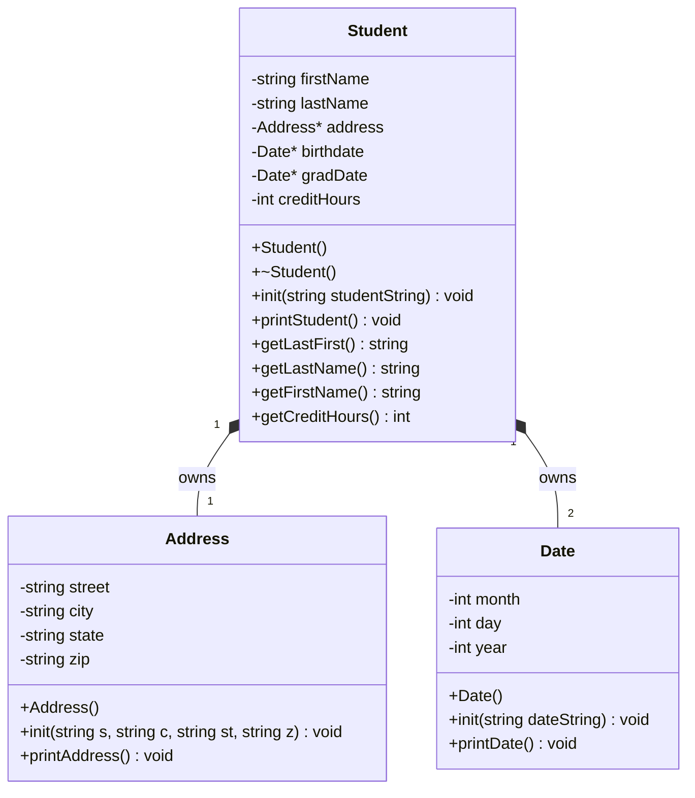

# HeapOfStudents UML

```mermaid
classDiagram
    class Address {
        -string street
        -string city
        -string state
        -string zip
        +Address()
        +init(string s, string c, string st, string z) void
        +printAddress() void
    }

    class Date {
        -int month
        -int day
        -int year
        +Date()
        +init(string dateString) void
        +printDate() void
    }

    class Student {
        -string firstName
        -string lastName
        -Address* address
        -Date* birthdate
        -Date* gradDate
        -int creditHours
        +Student()
        +~Student()
        +init(string studentString) void
        +printStudent() void
        +getLastFirst() string
        +getLastName() string
        +getFirstName() string
        +getCreditHours() int
    }

    Student "1" *-- "1" Address : owns
    Student "1" *-- "2" Date : owns
```

Student copying and copy assignment are disabled because it owns heap objects.
